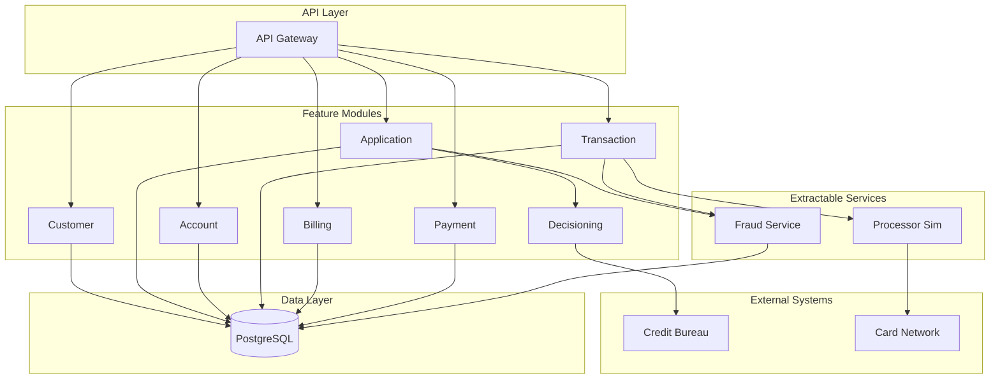

# Credit Card Lending Platform


> A demonstration of **intelligent Engineering (iE)** practices using Claude Code, with a credit card issuer system as the learning vehicle.

## Why This Exists

**Every developer wants to get better at using AI tools.** But most tutorials show toy examples - a TODO app, a simple script. Real software is messier: complex domains, multiple modules, evolving requirements, and the need for maintainable architecture.

This repository is a **learning sandbox** where you can see (and practice) how to use AI assistants effectively on a non-trivial codebase:

- **Watch real commits** built with AI assistance using TDD
- **Read the context docs** that make AI collaboration effective
- **Try the workflow** yourself with `/pickup` and `/start-dev`
- **See the mistakes and iterations** - this isn't a polished demo, it's a real project

The credit card lending domain is intentionally complex (PCI compliance, fraud detection, billing cycles) so you can learn patterns that transfer to your own messy, real-world projects.

### New Here?

**With Claude Code:** Run `/tour` for a guided walkthrough of the repo and workflow.

**Without Claude Code:** Browse [`docs/tour/`](docs/tour/) to follow along at your own pace.

<!-- TODO: Tour is coming soon - see #53 -->

## What is This?

A **modular monolith** credit card issuer platform covering the complete lifecycle:



Built using **intelligent Engineering (iE)** - a framework for leveraging AI throughout the entire Software Development Lifecycle. Rather than replacing the SDLC, iE applies AI assistance across all phases to reduce administrative overhead and empower developers to focus on strategy and creativity.

## intelligent Engineering (iE)

### What is iE?

iE uses AI (Claude Code) as a collaborative partner throughout development:

- **Research & Analysis**: Understanding requirements, exploring codebases
- **Design**: Discussing approaches, making architectural decisions
- **Build**: TDD with AI assistance, code generation
- **Test**: Writing tests, reviewing coverage
- **Documentation**: Keeping docs in sync with code

### Techniques Used Here

| Technique | Purpose |
|-----------|---------|
| **Context Documentation** (`docs/context/`) | Dense, factual docs optimized for LLM consumption |
| **CLAUDE.md** | Project-specific instructions Claude Code reads automatically |
| **Slash Commands** | `/pickup`, `/start-dev`, `/update-context` for workflow automation |
| **Story Template** | Every story includes "Context Docs to Update" section |
| **TDD Workflow** | Red-Green-Refactor cycle with AI assistance |

### The Workflow

<!-- TODO: Add workflow GIF here once created (see GitHub issue for GIF creation) -->

```
/pickup          → Assign yourself a prioritized story
/start-dev       → Begin TDD development with design discussion
                   → Red-Green-Refactor cycles with commits
                   → Update context docs
                   → Push to main
```

For more details, see the [intelligent Engineering Wiki Guide](https://github.com/javatarz/credit-card-lending/wiki/intelligent-Engineering).

## Quick Start

### Prerequisites

- [mise](https://mise.jdx.dev/) - Tool version management
- [Docker](https://www.docker.com/) - Any engine (Docker Desktop, Colima, OrbStack, etc.)

See [CONTRIBUTING.md](CONTRIBUTING.md#prerequisites) for installation instructions.

### Setup

```bash
# Clone the repository
git clone git@github.com:javatarz/credit-card-lending.git
cd credit-card-lending

# Run the setup script (installs Java, starts PostgreSQL, builds)
./scripts/setup.sh

# Run the application
./gradlew bootRun
```

The application will be available at:
- API: http://localhost:8080
- Swagger UI: http://localhost:8080/swagger-ui.html
- Health: http://localhost:8080/actuator/health

### Using Claude Code

```bash
# Install Claude Code (if not already installed)
# See: https://docs.anthropic.com/en/docs/claude-code

# Start Claude Code in the project directory
claude

# Pick up a story
/pickup

# Start TDD development
/start-dev
```

## Documentation

| What | Where | Audience |
|------|-------|----------|
| **Design & Architecture** | [GitHub Wiki](https://github.com/javatarz/credit-card-lending/wiki) | Humans |
| **Context Documentation** | [`docs/context/`](docs/context/) | Claude Code / LLMs |
| **Technical Decisions** | [`docs/adr/`](docs/adr/) | Both |
| **Epics & Stories** | [GitHub Issues](https://github.com/javatarz/credit-card-lending/issues) | Both |
| **Claude Code Instructions** | [`CLAUDE.md`](CLAUDE.md) | Claude Code |
| **API Documentation** | [Swagger UI](http://localhost:8080/swagger-ui.html) | Both |

### Key Context Documents

- [`docs/context/overview.md`](docs/context/overview.md) - System architecture
- [`docs/context/conventions.md`](docs/context/conventions.md) - Code patterns and standards
- [`docs/context/testing.md`](docs/context/testing.md) - TDD principles and test strategy
- [`docs/context/current-state.md`](docs/context/current-state.md) - What's built vs planned

## Tech Stack

Java 25 LTS, Spring Boot 4.x, PostgreSQL 16.x, Gradle 9.x.

See [`docs/context/overview.md`](docs/context/overview.md) for full tech stack and [ADR-003](docs/adr/ADR-003-technology-stack.md) for rationale.

## Architecture

**Modular Monolith** with clear module boundaries, designed for future service extraction.

See [`docs/context/overview.md`](docs/context/overview.md) for full architecture details and the [Architecture Wiki](https://github.com/javatarz/credit-card-lending/wiki/Architecture) for design docs.

## Contributing

See [CONTRIBUTING.md](CONTRIBUTING.md) for setup instructions and contribution guidelines.

**Quick contribution workflow:**
1. Run `/pickup` to assign yourself a story
2. Run `/start-dev` to begin TDD development
3. Follow the Red-Green-Refactor cycle
4. Update context docs as needed
5. Push to main

## Results

Using this workflow, the Customer module (registration, email verification, profile management with PCI-compliant SSN encryption) was built entirely with AI assistance using TDD. Every commit in this repo was created with Claude Code.

*Have you used iE patterns in your own project? [Open a discussion](https://github.com/javatarz/credit-card-lending/discussions) to share your experience.*

<!-- TODO: Add links to blog posts and case studies as they're published -->

## License

This project is licensed under the MIT License - see the [LICENSE](LICENSE) file for details.
